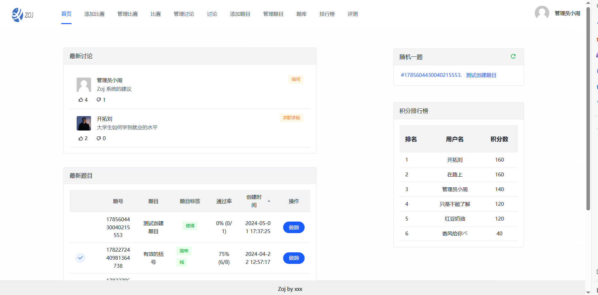
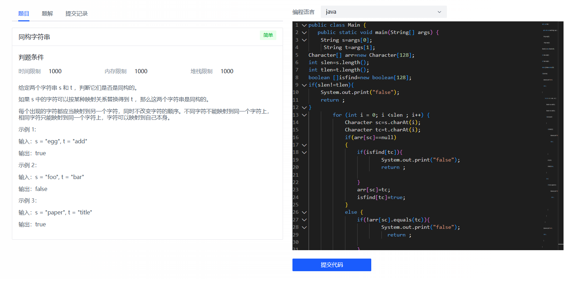
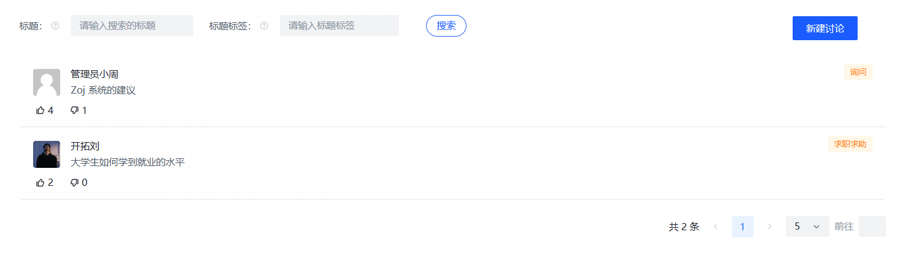
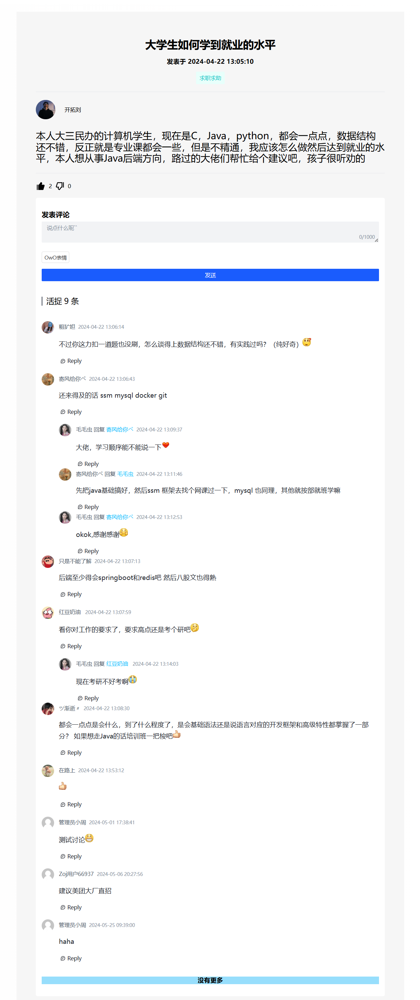
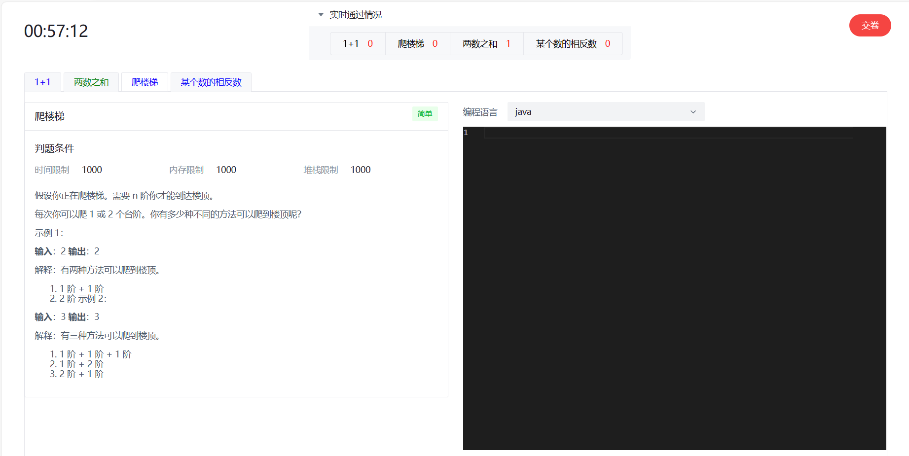
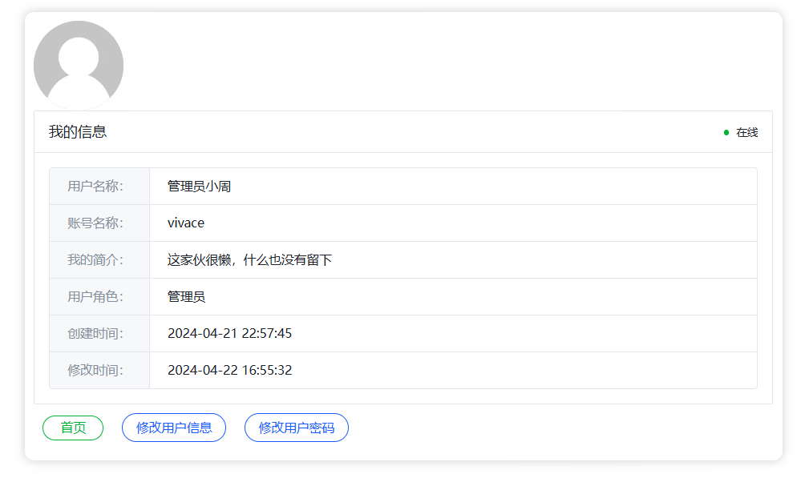

# Zoj
本系统是基于前端Vue3框架，后端SpringBoot框架，采用MyBatis-Plus简化数据库操作，以及采用MySQL数据库开发的OJ系统。

在程序员鱼皮的oj项目的基础上进行了二次开发

### 参考资料
https://yuyuanweb.feishu.cn/wiki/LhjxwgFjwiovTVk9w2vcJoj4nid

## 界面展示
### 首页

### 题库页面

### 做题页面

### 浏览讨论页面

### 讨论详细页面

### 在线比赛页面

### 个人主页

排行榜  评测  各种管理页面等可以自行查看

